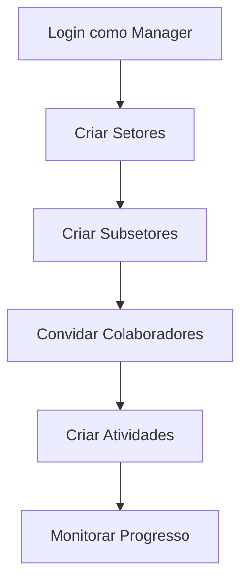
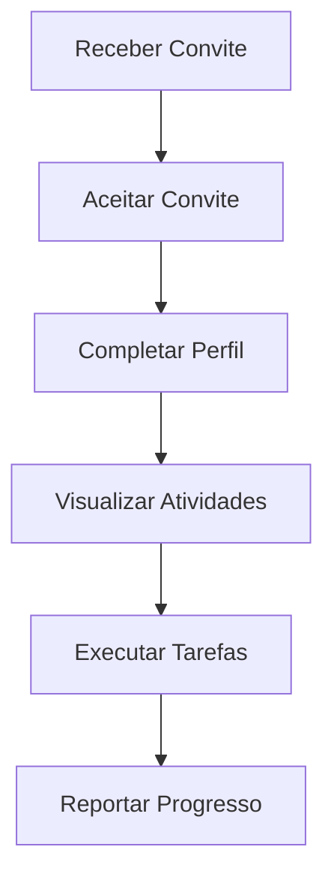

# 🏗️ VCA TASKS - Sistema de Gestão de Atividades

<div align="center">


[](https://www.typescriptlang.org/)
[](https://reactjs.org/)
[](https://supabase.com/)
[](https://tailwindcss.com/)

**Sistema moderno de gestão de atividades semanais com calendário interativo e colaboração em equipe para a VCA Construtora**

[🚀 Demo](#demo) • [📖 Documentação](#documentação) • [🛠️ Instalação](#instalação) • [🎯 Funcionalidades](#funcionalidades)

</div>

---

## 📋 Índice

- [🎯 Sobre o Projeto](#-sobre-o-projeto)
- [✨ Funcionalidades](#-funcionalidades)
- [🛠️ Tecnologias](#️-tecnologias)
- [🚀 Instalação](#-instalação)
- [📱 Como Usar](#-como-usar)
- [🏗️ Arquitetura](#️-arquitetura)
- [📊 Database Schema](#-database-schema)
- [🔒 Segurança](#-segurança)
- [📈 Deploy](#-deploy)
- [🤝 Contribuição](#-contribuição)
- [📝 Licença](#-licença)
- [👨‍💻 Desenvolvedor](#-desenvolvedor)

---

## 🎯 Sobre o Projeto

O **VCA TASKS** é um sistema completo de gestão de atividades desenvolvido especificamente para a VCA Construtora. A aplicação permite gerenciamento eficiente de tarefas, acompanhamento de prazos, colaboração em equipe e organização por setores e subsetores.

### 🎨 Interface Moderna

- Design responsivo e intuitivo
- Tema escuro/claro
- Componentes reutilizáveis com shadcn/ui
- Experiência mobile-first

### 🏢 Estrutura Organizacional

- **Setores**: Diferentes áreas da empresa
- **Subsetores**: Subdivisões específicas
- **Perfis de Usuário**: Manager e Collaborator
- **Sistema de Convites**: Onboarding automatizado

---

## ✨ Funcionalidades

### 📊 **Dashboard e Calendário**

- 📅 Calendário interativo com visualização mensal
- 📈 Métricas em tempo real de atividades
- 🎯 Visão geral do status das tarefas
- 📱 Interface responsiva para todos os dispositivos

### 👥 **Gestão de Equipe**

- 👤 Perfis de usuário personalizáveis
- 🏢 Organização por setores e subsetores
- 📧 Sistema de convites por email
- 🔐 Controle de acesso baseado em roles

### ✅ **Gerenciamento de Atividades**

- ➕ Criação e edição de atividades
- 📋 Sistema de subtarefas
- 🏷️ Categorização por prioridade
- ⏰ Controle de prazos e vencimentos
- 📁 Arquivamento e histórico

### 🔔 **Notificações e Comunicação**

- 🔔 Notificações em tempo real
- 📧 Emails automáticos de convite
- 📊 Relatórios de progresso
- 💬 Sistema de comentários (futuro)

### 🎨 **Personalização**

- 🌙 Tema escuro/claro
- 🖼️ Upload de avatares
- ⚙️ Configurações personalizáveis
- 🏗️ Branding VCA Construtora

---

## 🛠️ Tecnologias

<div align="center">

| Frontend        | Backend           | Database              | Deploy           |
| --------------- | ----------------- | --------------------- | ---------------- |
| ⚛️ React 18     | 🔥 Supabase       | 🐘 PostgreSQL         | ▲ Vercel         |
| 📘 TypeScript   | 🔐 Auth (RLS)     | 📊 Real-time          | 🌐 Custom Domain |
| 🎨 Tailwind CSS | 📧 Edge Functions | 🔄 Migrations         | 📱 PWA Ready     |
| 🧩 shadcn/ui    | 📁 Storage        | 🔒 Row Level Security | 🚀 CDN           |

</div>

### 📦 Principais Dependências

```json
{
  "react": "^18.2.0",
  "typescript": "^5.0.0",
  "tailwindcss": "^3.4.0",
  "@supabase/supabase-js": "^2.38.0",
  "react-router-dom": "^6.8.0",
  "react-hook-form": "^7.48.0",
  "date-fns": "^2.30.0",
  "lucide-react": "^0.263.0"
}
```

---

## 🚀 Instalação

### 📋 Pré-requisitos

- Node.js 18+
- npm ou yarn
- Conta no Supabase
- Git

### 🔧 Configuração Local

```bash
# 1. Clone o repositório
git clone https://github.com/maurodk/week-flow-hub.git
cd week-flow-hub

# 2. Instale as dependências
npm install

# 3. Configure as variáveis de ambiente
cp .env.example .env.local

# 4. Configure o Supabase
# Edite o .env.local com suas credenciais

# 5. Execute as migrações do banco
npm run supabase:migrate

# 6. Inicie o servidor de desenvolvimento
npm run dev
```

### 🌐 Variáveis de Ambiente

```env
# Supabase
VITE_SUPABASE_URL=your_supabase_url
VITE_SUPABASE_ANON_KEY=your_supabase_anon_key

# Email (Resend)
RESEND_API_KEY=your_resend_api_key
```

---

## 📱 Como Usar

### 👤 **Primeiro Acesso**

1. **Registre-se** com email e senha
2. **Defina seu perfil** (nome, foto, setor)
3. **Explore o dashboard** e familiarize-se com a interface

### 🏢 **Para Managers**



### 👥 **Para Collaborators**



---

## 🏗️ Arquitetura

### 🎨 **Frontend Architecture**

```
src/
├── components/          # Componentes reutilizáveis
│   ├── ui/             # Componentes base (shadcn/ui)
│   ├── layout/         # Layout e navegação
│   ├── activities/     # Componentes de atividades
│   ├── auth/           # Autenticação
│   └── calendar/       # Calendário interativo
├── pages/              # Páginas da aplicação
├── hooks/              # Hooks customizados
├── contexts/           # Contexts do React
├── lib/                # Utilitários e configurações
├── types/              # Tipos TypeScript
└── stores/             # Gerenciamento de estado
```

### 🔄 **Estado da Aplicação**

- **Zustand**: Gerenciamento de estado global
- **React Query**: Cache e sincronização de dados
- **React Hook Form**: Gerenciamento de formulários
- **Context API**: Estados específicos

---

## 📊 Database Schema

### 🗄️ **Principais Tabelas**

```sql
-- Estrutura organizacional
sectors (id, name, description)
subsectors (id, name, sector_id)
profiles (id, email, full_name, role, sector_id, subsector_id)

-- Gestão de atividades
activities (id, title, description, status, priority, due_date, user_id, sector_id)
subtasks (id, activity_id, title, is_completed)
activity_history (id, activity_id, action, performed_by, details)

-- Sistema de convites
invitations (id, email, token, role, sector_id, expires_at)
notifications (id, user_id, title, message, read, created_at)
```

### 🔐 **Row Level Security (RLS)**

- Políticas baseadas em setor e role
- Isolamento de dados por organização
- Controle granular de permissões

---

## 🔒 Segurança

### 🛡️ **Autenticação**

- JWT tokens seguros
- Refresh token automático
- Session management

### 🔐 **Autorização**

- Role-based access control (RBAC)
- Row Level Security (RLS)
- Políticas granulares no Supabase

### 📧 **Email Security**

- Tokens únicos para convites
- Expiração automática
- Validação de domínio

---

## 📈 Deploy

### ▲ **Vercel Deploy**

```bash
# 1. Configure as variáveis de ambiente na Vercel
VITE_SUPABASE_URL
VITE_SUPABASE_ANON_KEY

# 2. Configure o build
Build Command: npm run build
Output Directory: dist
Install Command: npm install

# 3. Configure o domínio no Supabase
# Adicione o domínio da Vercel nas configurações de Auth
```

### 🌐 **Configurações Adicionais**

```json
// vercel.json
{
  "rewrites": [
    {
      "source": "/(.*)",
      "destination": "/index.html"
    }
  ]
}
```

---

## 🤝 Contribuição

Contribuições são sempre bem-vindas! Para contribuir:

1. 🍴 Fork o projeto
2. 🌿 Crie uma branch para sua feature (`git checkout -b feature/AmazingFeature`)
3. 💾 Commit suas mudanças (`git commit -m 'Add some AmazingFeature'`)
4. 📤 Push para a branch (`git push origin feature/AmazingFeature`)
5. 🔃 Abra um Pull Request

### 📝 **Guidelines**

- Use TypeScript
- Siga os padrões ESLint
- Escreva testes quando necessário
- Documente mudanças significativas

---

## 📝 Licença

Este projeto está sob a licença MIT. Veja o arquivo [LICENSE](LICENSE) para mais detalhes.

---

## 👨‍💻 Desenvolvedor

<div align="center">

### **Carlos Mauricio Jr.**

_Full Stack Developer_

[](https://linkedin.com/in/carlosmauro)
[](https://github.com/carlosmauro)
[](mailto:carlos@vcaconstrutora.com.br)

_Desenvolvido com ❤️ para a VCA Construtora_

</div>

---

<div align="center">

**⭐ Se este projeto foi útil, deixe uma estrela!**

**🔗 [VCA Construtora](https://vcaconstrutora.com.br) | [Documentação Completa](docs/)**

</div>
